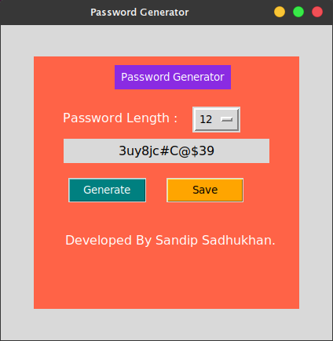

# Smart Password Generator
It is a smart and handy password generator application developed by [sandip Sadhukhan](https://yourwebsite.github.io/) with python.

## Requirement
* python 3
## Download the App
go to your terminal or Command Prompt and write the following lines
```bash
git clone https://github.com/sandipsadhukhan/passwordGenerator.git
```
## Run the App
### On Mac os/Linux
```bash
cd passwordGenerator
python3 passwordGenerator.py
```
### On Windows
```bash
cd passwordGenerator
python passwordGenerator.py
```
## Screenshot


## Feature
* [x] Set Length
* [x] Save Password
## Sponsors
<a href="https://youtube.com/c/bongtuts"></a>
